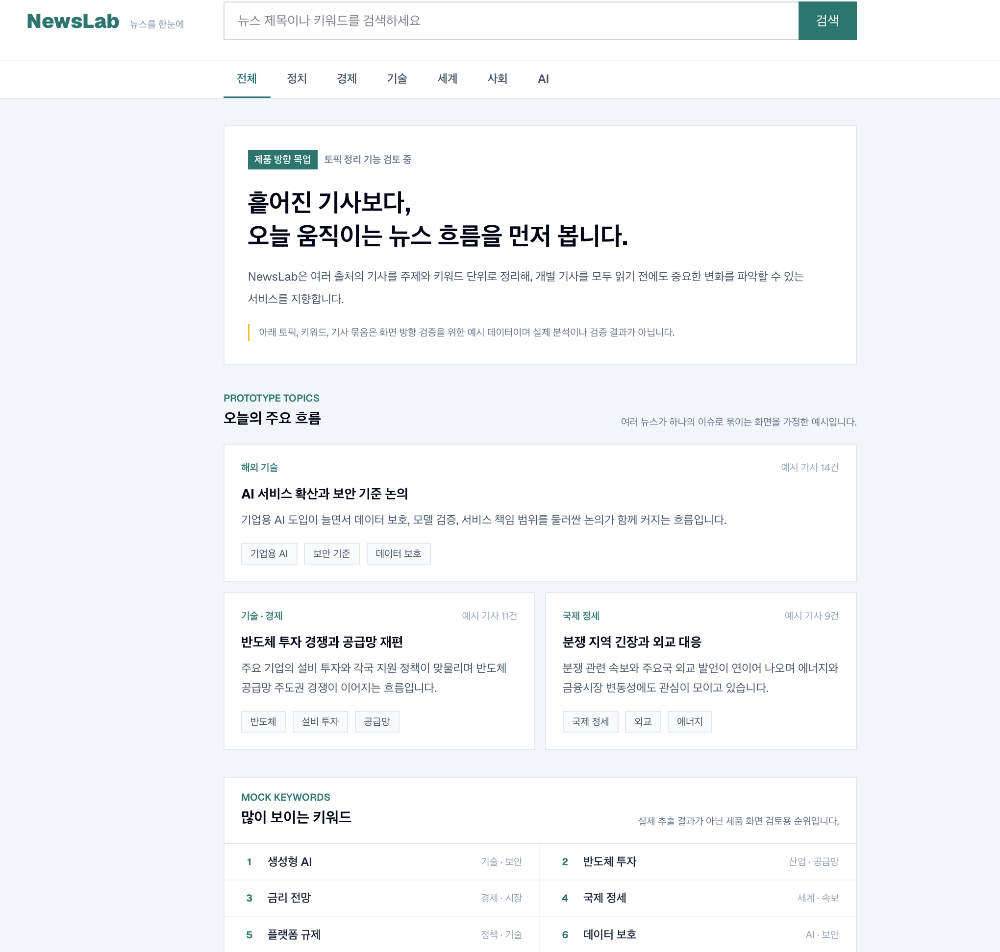

# NewsLab Web

NewsLab Web은 여러 출처의 뉴스를 한눈에 탐색하고 주요 흐름을 정리해 보여주는 NewsLab 프로젝트의 프론트엔드 애플리케이션입니다. 현재 메인 화면은 NewsLab backend의 실제 `/topics` 주요 이슈와 `/articles` 최신 기사 목록을 함께 제공합니다.

## 기술 스택

- Next.js App Router
- TypeScript
- Tailwind CSS
- npm

## 요구 사항

- `.node-version`에 명시된 Node.js 버전
- npm

## 로컬 실행

의존성을 설치합니다.

```bash
npm ci
```

API 연동 작업에서 로컬 환경변수가 필요한 경우에만 예시 파일을 복사합니다.

```bash
cp .env.example .env.local
```

필요한 경우 로컬 백엔드 주소에 맞게 `.env.local`을 수정합니다. 실제 `.env` 파일은 커밋하지 않습니다.

개발 서버를 실행합니다.

```bash
npm run dev
```

[http://localhost:3000](http://localhost:3000)에서 확인할 수 있습니다.

## 현재 화면 구성

- 서비스명과 검색 UI가 포함된 헤더
- 전체, 정치, 경제, 기술, 세계, 사회, AI 카테고리 탐색 UI
- NewsLab의 뉴스 흐름 정리 가치를 설명하는 상단 영역
- 실제 `/topics` API 기반 오늘의 주요 이슈
- mock data 기반 키워드, 관련 기사 묶음 prototype
- 이미지 없이 읽기 쉬운 실제 `/articles` 최신 기사 목록
- 추후 광고, 필터, 랭킹, 수집 상태, 추천 영역을 넣을 수 있는 좌우 side slot
- 데스크톱과 모바일 반응형 레이아웃

현재 검색, 카테고리, 좌우 side slot은 구조만 제공하며, 실제 검색, API 필터링, 페이지네이션, 광고, 추천 로직은 구현하지 않았습니다.

## Topics API 연동

- Server Component에서 `GET /topics?page=1&page_size=10`을 호출합니다.
- 응답 topic의 제목, 요약, 키워드, 출처 수, 기사 수, 날짜, status, provider/model을 표시합니다.
- API 호출 실패, 빈 topic 목록, loading 상태에 대한 기본 화면을 제공합니다.
- 많이 보이는 키워드와 관련 기사 묶음 영역은 여전히 제품 방향 검증을 위한 mock/prototype UI입니다.
- 실제 `/articles` API 기반 최신 기사 목록은 메인 화면 하단 보조 영역에서 계속 제공합니다.

## 기사 API 연동

- Server Component에서 `GET /articles?page=1&page_size=10`을 호출합니다.
- API base URL은 `NEXT_PUBLIC_NEWSLAB_API_BASE_URL`에서 읽습니다.
- 응답 기사는 화면용 view model로 변환한 뒤 category, title, source, published time, optional metadata를 표시합니다.
- 유효한 `http` 또는 `https` 기사 URL은 새 탭에서 원문을 엽니다.
- API 호출 실패 또는 빈 기사 목록에 대한 기본 상태 화면을 제공합니다.

## 환경변수

| 이름 | 필요 시점 | 설명 |
| --- | --- | --- |
| `NEXT_PUBLIC_NEWSLAB_API_BASE_URL` | API 연동 시 | NewsLab 백엔드 API base URL입니다. `.env.example`에는 로컬 placeholder만 두고 실제 값은 `.env.local`에서 관리합니다. |

## 검증

Pull Request 전에 아래 명령을 실행합니다.

```bash
npm run lint
npm run typecheck
npm run build
git diff --check
git grep -n -i -E "API_KEY|TOKEN|SECRET|PASSWORD|PRIVATE KEY|BEGIN|\\.env"
```

credential scan은 문서의 `.env` 안내도 탐지할 수 있으므로 실제 secret 값이 포함되었는지 확인합니다.

## 화면 예시

아래 화면은 Topics API 연결 전 NewsLab Web의 토픽 중심 메인 화면 목업입니다.

현재 화면의 주요 이슈는 실제 `/topics` API를 사용하며, 키워드 순위와 관련 기사 묶음 영역은 mock prototype으로 유지됩니다. 하단의 최신 기사 목록은 NewsLab backend `/articles` API에서 가져온 실제 기사 데이터를 사용합니다.



## 범위 안내

- 백엔드, DB, Supabase, K3s, 운영 인프라는 이 저장소의 범위가 아닙니다.
- Docker와 운영 배포는 현재 프론트엔드 MVP 범위에 포함하지 않습니다.
- 검색, 카테고리 필터, 페이지네이션 UI는 후속 작업에서 진행합니다.
